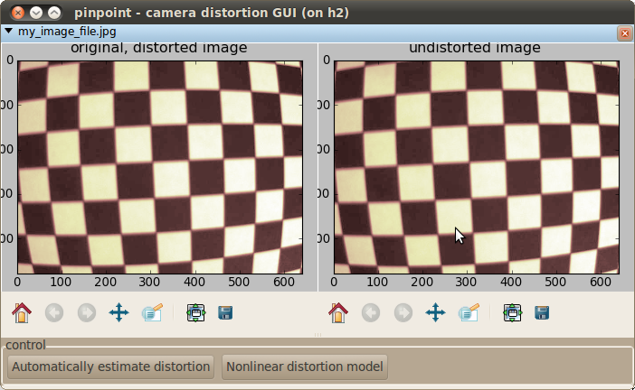
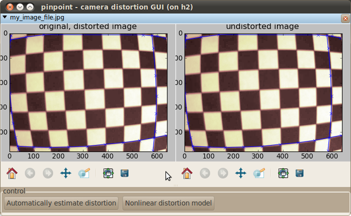
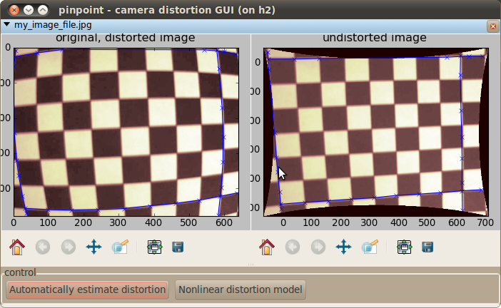
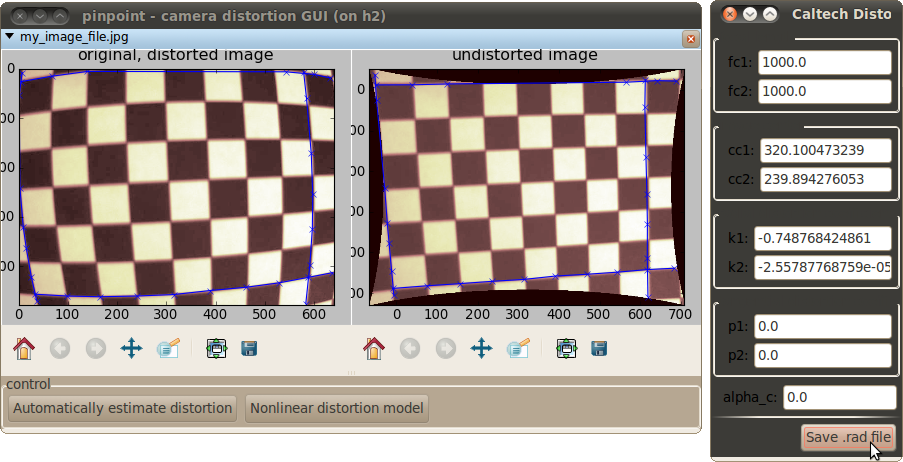

*******************************
pinpoint_distortion_gui program
*******************************

This program allows one to estimate the depth-independent non-linear
distortion created by many camera lenses. Fundamentally, this is a GUI
program for an implementation of the `Line-Based Correction of Radial
Lens Distortion`_ (GMIP 1997) algorithm by Prescott and McLean.

.. _Line-Based Correction of Radial Lens Distortion: http://dx.doi.org/10.1006/gmip.1996.0407

Using the program - a walk-through
==================================

Step 1 - opening an image
-------------------------

From the command line, start the program with an image file from your
camera::

  pinpoint_distortion_gui my_image_file.jpg

This should open a window that looks something like this:

(If you don't see the images, click the little triangle next to the
file name to show them.)

Step 2 - mark lines
-------------------

There use the following keys to tell the program about lines in your
images: (You may have to click once on the image before it will
register your keystrokes.)

 * "p" will add a point to the current line
 * "n" will create a new line
 * "c" will clear all your lines.

As you add points and lines, these will be drawn on the image. They
will also be printed to the console.

Because the edges of your image contain the most distortion, it is
most robust to create lines near the edges. A set of lines ready for
distortion estimation looks like this:

Note that you do not need to take images of checkerboards for this to
work, nor do you need to click on the checkerboard corners. These are
simply convenient objects to photograph, because all the contrast in
them should be straight lines.

Step 3 - estimate distortion
----------------------------

When you have a few lines marked in your image, and you are ready to
estimate the distortion, click the "Automatically estimate distortion"
button. Your computer should be busy calculating for several seconds
(or longer), and then will hopefully have created a very accurate
model of the distortions of your lens. This should be immediately
apparent because the "undistorted image" window should contain an
image without distortion, like this:

Step 4 - save the distortion parameters
---------------------------------------

Finally, save the distortion parameters to a .rad file. Click the
"Nonlinear distortion model" button to view the model parameters
window, and then click "Save .rad file" to open a file save dialog.

The saved .rad files are compatible with `Bouget's camera toolbox
<http://www.vision.caltech.edu/bouguetj/calib_doc/htmls/parameters.html>`__
and `Svoboda's Multi-Camera Self Calibration Toolbox
<http://cmp.felk.cvut.cz/~svoboda/SelfCal/>`__.

